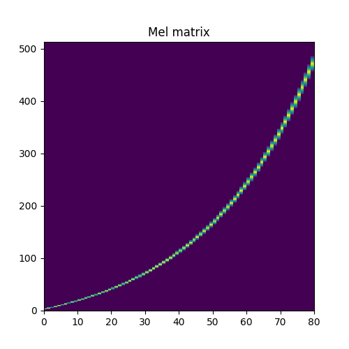
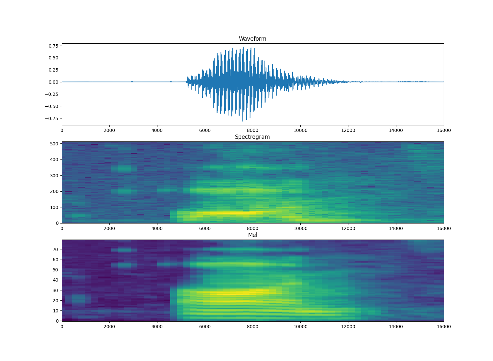
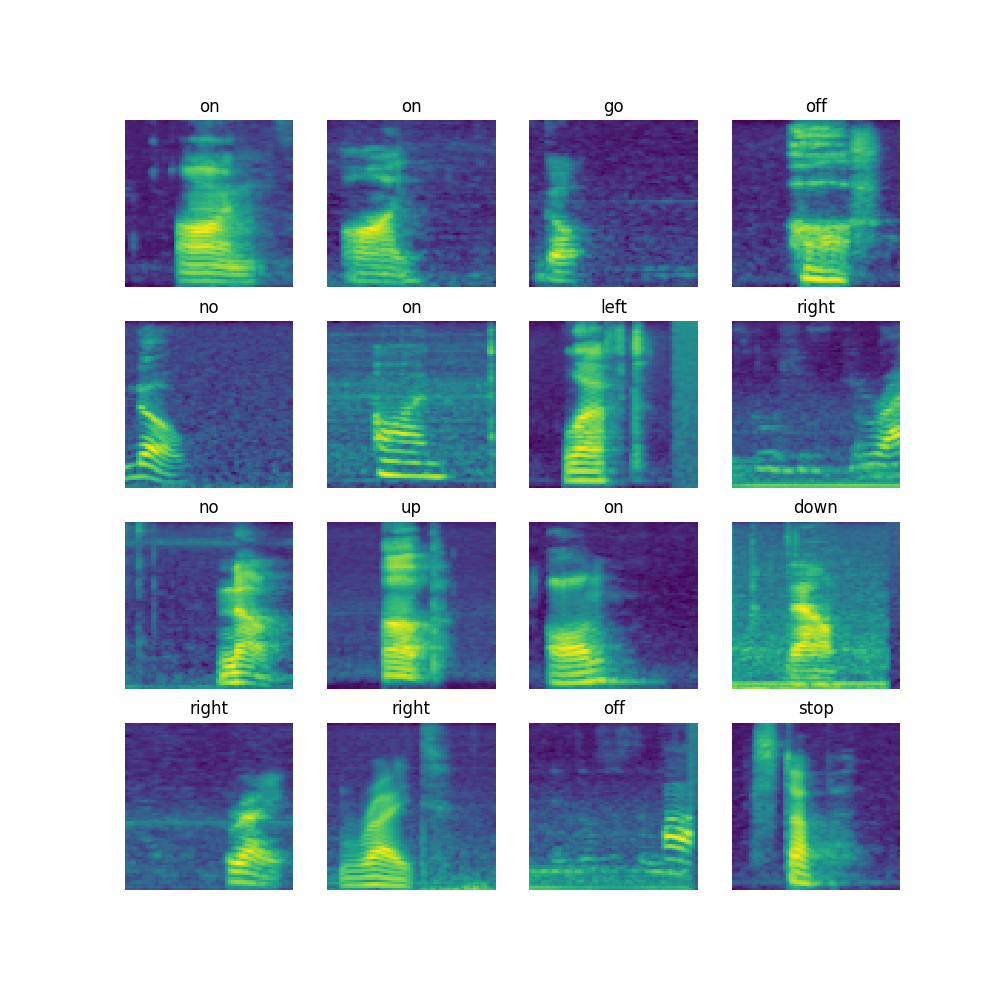
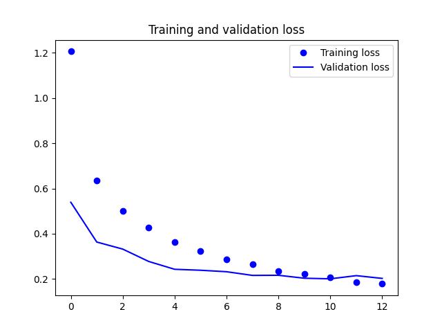
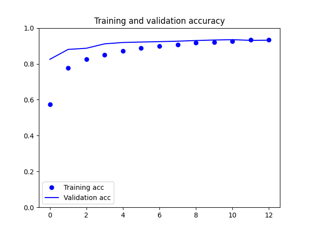
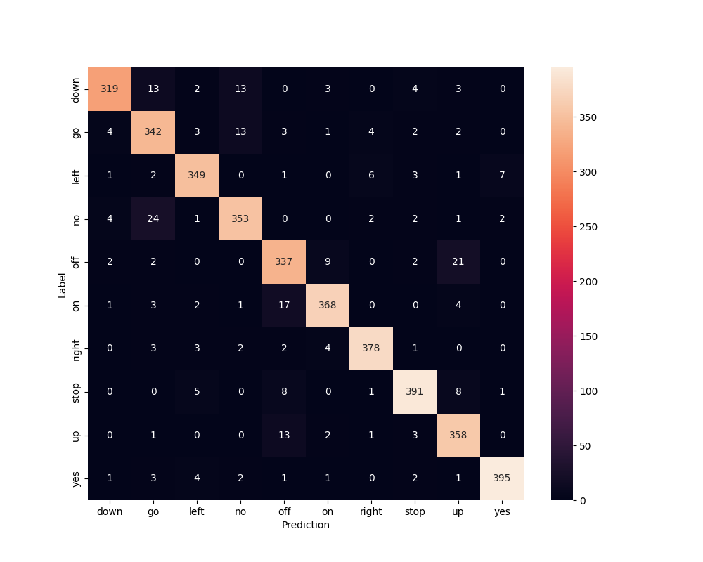

# Training the CNN model

The training script is based on [Simple audio recognition: Recognizing keywords](https://www.tensorflow.org/tutorials/audio/simple_audio).
There is one modification - the spectrum is additionally passed through Mel filter bank.
This is essentially multiplication by a matrix created using TF `signal.linear_to_mel_weight_matrix` function:




This makes the speech features more pronounced:



Let's look at some more samples:



If a human can better see the differences we can hope a CNN will also
have better accuracy. The same model is used as in the tutorial:

```
 Layer (type)                Output Shape              Param #   
=================================================================
 resizing (Resizing)         (None, 32, 32, 1)         0         
                                                                 
 normalization (Normalizatio  (None, 32, 32, 1)        3         
 n)                                                              
                                                                 
 conv2d (Conv2D)             (None, 30, 30, 32)        320       
                                                                 
 conv2d_1 (Conv2D)           (None, 28, 28, 64)        18496     
                                                                 
 max_pooling2d (MaxPooling2D  (None, 14, 14, 64)       0         
 )                                                               
                                                                 
 dropout (Dropout)           (None, 14, 14, 64)        0         
                                                                 
 flatten (Flatten)           (None, 12544)             0         
                                                                 
 dense (Dense)               (None, 128)               1605760   
                                                                 
 dropout_1 (Dropout)         (None, 128)               0         
                                                                 
 dense_1 (Dense)             (None, 10)                1290      
                                                                 
=================================================================
Total params: 1,625,869
Trainable params: 1,625,866
Non-trainable params: 3
```

Here are the results:





Accuracy for random sample from test set is: 93.1%

Here are also some embedding projections of the `dense` layer (128 dimensions).

### PCA


### UMAP


### t-SNE


